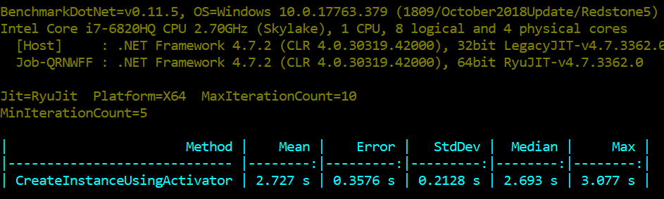
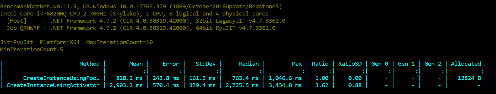

MS Office Interop Automation in C#

Problem Statement: For instance, online training web site asked students to submit their assignments for Microsoft Office Access.  The Project involves performing many tasks in MS Access. and evaluating projects manually will be impossible for site with thousands of concurrent users. So, it will require automation for instant feedback and accurate grading; right?

How to automate: We have to create & release instance of MS Access Application object. However, it can be achieved in two ways:

1. Add reference to Office Interop dll's as shown in below code snippet.
2. Late Bind, use Type.GetTypeFromProgID("Access.Application") to get type, rest of the code stays same. 

Major difference between these two are, the first one requires interop assemblies to added as reference, while second one relies on (late binding) version of MS office access installed on your computer. 

```
var instance =(Application)Activator.CreateInstance(Marshal.GetTypeFromCLSID(new Guid("73A4C9C1-D68D-11D0-98BF-00A0C90DC8D9")));
//instance.OpenCurrentDatabase(filepath: "", Exclusive: true, //bstrPassword: string.Empty);
//Performing required operations (Read & Write) 
instance.Quit(AcQuitOption.acQuitSaveAll);
Marshal.ReleaseComObject(instance)

```

Context: As stated in problem, we have thousands of concurrent users,  who have started to submit the assignment. Since each project  has to be graded separately, we have to create separate instance of MS Access application com object and release it; so the orphaned process do not keep hanging in memory. Same Application object instance can not be used for two different files, if  so it will throw error. 

How will we handle hundred's of concurrent requests? To plan for it, we will have to answer multiple questions. How much memory is consumed for one instance creation as it will launch MS Access process? What percentage of CPU will be used for one instance? How long it takes to create one instance and release it?

It turns out on my local machine, one MS Access process takes 60 MB of memory. Creating one instance requires about 20-25% CPU. Lastly, it takes 2.72 seconds to create, quit, and release MS Access Application com object. For the proof, i ran Benchmark using Benchmarkdotnet, which is super awesome library for micro benchmarks. Benchmark ran on my local machine:



As per above metrics, we can only serve 4 concurrent requests from one local system. Even after putting this service, behind load balancer, adding, let say 10 servers in pool, we will only be able serve ~40 concurrent requests. Let's assume business logic takes about 500 ms, and it will take around 3 seconds to serve one request, it means service queue will keep growing, and system will crash or very slow. Asyncing the service might make things little better, but it is yet to be tested.

Here is what we can do about it, getting to the point. We can implement this by Object pooling pattern. Here, I am using Microsoft.Extensions.ObjectPool abstraction to implement it, which is very cool, i did not had to think about abstractions, which is tough job. I went ahead implementing simple pool, using ConcurrentQueue as backing store, also to avoid any threading issues. Repository is available here along with benchmarks. Here is the final benchmark results, Pool performs 3x better than non-pool approach.



Conclusion: It's very special case scenario, but if we go back to our problem statement, we will be able to scale better by putting less hardware. 

Further Improvements: I am thinking to poll CPU & Memory usage, based on configured values and pool can always be kept to full to increase the Hit ratio, but it will be tricky to implement it.

Issues: What if app pool crashed or restarted, all the instance in pool, associated with process? and keep hanging in there. The strategy will be to quit and release those. It's tricky, simple solution can be standalone windows service, which can take care of release part