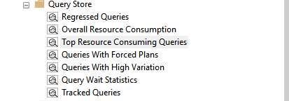
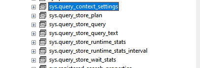
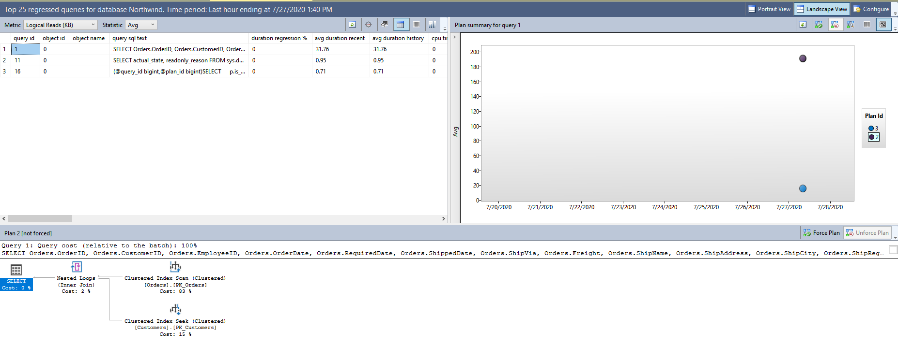

Query Store allows you to monitor and troubleshoot queries. It also provides stats about runtime such as CPU, IO and Memory.

Enable Query Store with default configuration using below SQL. It is enabled at database level.
~~~ SQL
ALTER DATABASE DatabaseName
SET QUERY_STORE = ON ( WAIT_STATS_CAPTURE_MODE = ON );
~~~ 

Query Store is enabled at database level. It can not be enabled on master & tempdb. It collects data in asynchronous way. Thus it does not affect query performance. 

Once you run the above script. You should see a node under your database named 'Query Store'.

Query Store Interactive Reports

Query Store Views

Query Stores Options can be queries.
~~~ SQL
SELECT * FROM sys.database_query_store_options;
~~~
## Use Case 01 - Detect Query Performance Regression

Suppose you deployed a new release to production. As load increases, you started receiving timeout alerts if you have it configured. Or customer(s) are complaining slowness in general or intermittent time out issues.

_Without Query Store_, you will need handy scripts ready to fetch query plan to make sense of why regression has been introduced. It is not gurannted that you will be able to find the bad query plan. As SQL Server does not store plan history.  

_With Query Store_ you can find different plans used by this query. Compare those plan & understand usage of resources. 

### Northwind database Example - Detect Regression

Create Northwind database - You can get the scripts with data from here [Northwind Schema & Data](https://github.com/microsoft/sql-server-samples/blob/master/samples/databases/northwind-pubs/instnwnd.sql)

Enable Query Store by executing below
~~~
ALTER DATABASE Northwind
SET QUERY_STORE = ON ( WAIT_STATS_CAPTURE_MODE = ON );
~~~

Now we use the below query to cause regression.

~~~ SQL 
SELECT Orders.OrderID, Orders.CustomerID, Orders.EmployeeID, Orders.OrderDate, Orders.RequiredDate, 
	Orders.ShippedDate, Orders.ShipVia, Orders.Freight, Orders.ShipName, Orders.ShipAddress, Orders.ShipCity, 
	Orders.ShipRegion, Orders.ShipPostalCode, Orders.ShipCountry, 
	Customers.CompanyName, Customers.Address, Customers.City, Customers.Region, Customers.PostalCode, Customers.Country
FROM Customers INNER JOIN Orders ON Customers.CustomerID = Orders.CustomerID
WHERE ShippedDate > GETDATE()
~~~

Since `Orders` table have non-clustered index on `ShippedDate`. Lets drop it by running below command.

~~~
DROP INDEX [ShippedDate] ON [dbo].[Orders]
GO
~~~

Now run the query 100 times by using below script.

~~~ SQL 
SELECT Orders.OrderID, Orders.CustomerID, Orders.EmployeeID, Orders.OrderDate, Orders.RequiredDate, 
	Orders.ShippedDate, Orders.ShipVia, Orders.Freight, Orders.ShipName, Orders.ShipAddress, Orders.ShipCity, 
	Orders.ShipRegion, Orders.ShipPostalCode, Orders.ShipCountry, 
	Customers.CompanyName, Customers.Address, Customers.City, Customers.Region, Customers.PostalCode, Customers.Country
FROM Customers INNER JOIN Orders ON Customers.CustomerID = Orders.CustomerID
WHERE ShippedDate > GETDATE()
GO 100
~~~
  
Lets create the non-clustered index which we dropeed earlier. After creating index run the above query again.

~~~ SQL
CREATE NONCLUSTERED INDEX [ShippedDate] ON [dbo].[Orders]
(
	[ShippedDate] ASC
)WITH (PAD_INDEX = OFF, STATISTICS_NORECOMPUTE = OFF, SORT_IN_TEMPDB = OFF, DROP_EXISTING = OFF, ONLINE = OFF, ALLOW_ROW_LOCKS = ON, ALLOW_PAGE_LOCKS = ON, OPTIMIZE_FOR_SEQUENTIAL_KEY = OFF) ON [PRIMARY]
GO
~~~

Now expan Query Store node under your database in SQL Server Studio. And click on Regressed Queries. You should be able to see report.

